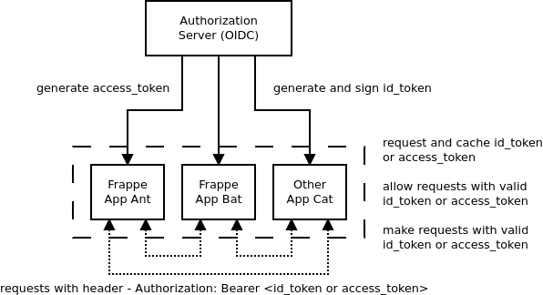

# Castlecraft

Castlecraft extensions for frappe microservice development.

It requires Authorization Server with following features:

- Token Introspection Endpoint
- ID Token verification using jwks uri

After installation of this app, request to frappe app can be made using `access_token` generated by central server.

## Usage Diagram



## Installation

Note: Works on version 13 onwards.

```shell
bench get-app castlecraft https://gitlab.com/castlecraft/cfe.git
bench --site <site-name> install-app castlecraft
```

## Configuration

Make following changes in `site_config.json` as per your setup:

```json
{
 ...
 // For Introspection
 "castlecraft_auth_header_enabled": 1,
 "castlecraft_auth_introspect_bearer_enabled": 1,
 "castlecraft_client_id": "client_id",
 "castlecraft_client_secret": "client_secret",
 "castlecraft_introspect_token_key": "access_token",
 "castlecraft_introspect_url": "https://accounts.example.com/oauth2/introspection",
 "castlecraft_fetch_userinfo": 1,
 "castlecraft_userinfo_url": "https://accounts.example.com/oauth2/profile",

// For id_token verification
 "castlecraft_auth_jwt_verify_bearer_enabled": 1,
 "castlecraft_jwks_url": "https://accounts.example.com/.well-known/jwks",
 "castlecraft_allowed_aud": ["client_id_or_allowed_aud_claim", "abe31e1c-c6d0-4415-8aa9-ca674685fa00"],

// Common
 "castlecraft_create_user_on_auth_enabled": 1,
 "castlecraft_email_key": "preferred_username",
 "castlecraft_first_name_key": "given_name",
 "castlecraft_full_name_key": "name",
 "castlecraft_username_key": "employee_id",
 "castlecraft_default_roles": ["Blogger"]
 ...
}
```

### For Introspection

- `castlecraft_auth_introspect_bearer_enabled`: When set to `1`, token is introspected to validate user.
- `castlecraft_auth_header_enabled`: When set to `1`, token is introspection endpoint uses basic auth with `client_id` and `client_secret`.
- `castlecraft_client_id`: Registered `client_id`.
- `castlecraft_client_secret`: Registered `client_secret`.
- `castlecraft_introspect_url`: Token introspection url.
- `castlecraft_introspect_token_key`: Key used to pass token to introspection endpoint. Defaults to `token`. Example request will have `token=abc123`.
- `castlecraft_fetch_userinfo`: If set to `1` user information will be fetched from userinfo instead of introspection response
- `castlecraft_userinfo_url`: Userinfo url. required if `castlecraft_fetch_userinfo` is used.

### For ID Token Verification

- `castlecraft_auth_jwt_verify_bearer_enabled`: When set to `1`, token is assumed to be jwt and verified using JWKS.
- `castlecraft_jwks_url`: JWKS URL required in case `castlecraft_auth_jwt_verify_bearer_enabled` is set to `1`
- `castlecraft_allowed_aud`: string or array of strings with valid `aud` used to verify `id_token`. Default to empty array `[]`.

### Common

- `castlecraft_create_user_on_auth_enabled`: When set to `1`, user with no roles will be created if not found in system.
- `castlecraft_email_key`: OIDC Claim or key to use for getting user's email. Default is `email`.
- `castlecraft_first_name_key`: OIDC Claim or key to use for getting user's first name. Default is `given_name`.
- `castlecraft_full_name_key`: OIDC Claim or key to use for getting user's full name. Default is `name`.
- `castlecraft_username_key`: OIDC Claim or key to use for setting user's `username`. Default is not set.
- `castlecraft_default_roles`: Array of roles to add to user on creation. Default is `[]`.
- `castlecraft_enable_log`: If set to `1`, `Error Log` will be created on auth errors.

Note: Either set `castlecraft_auth_introspect_bearer_enabled` or `castlecraft_auth_jwt_verify_bearer_enabled`, NOT both. In case both are set, auth `castlecraft_auth_introspect_bearer_enabled` will be considered.

## Backchannel Logout

Backchannel logout endpoint: `/api/method/castlecraft.services.oauth2.back_channel_logout`. Example: `https://example.com/api/method/castlecraft.services.oauth2.back_channel_logout`

## API Documentation

- [Github Pages](http://castlecraft.github.io/cfe)

## License

Copyright 2023 Castlecraft Ecommerce Pvt. Ltd.

Permission is hereby granted, free of charge, to any person obtaining a copy of this software and associated documentation files (the "Software"), to deal in the Software without restriction, including without limitation the rights to use, copy, modify, merge, publish, distribute, sublicense, and/or sell copies of the Software, and to permit persons to whom the Software is furnished to do so, subject to the following conditions:

The above copyright notice and this permission notice shall be included in all copies or substantial portions of the Software.

THE SOFTWARE IS PROVIDED "AS IS", WITHOUT WARRANTY OF ANY KIND, EXPRESS OR IMPLIED, INCLUDING BUT NOT LIMITED TO THE WARRANTIES OF MERCHANTABILITY, FITNESS FOR A PARTICULAR PURPOSE AND NONINFRINGEMENT. IN NO EVENT SHALL THE AUTHORS OR COPYRIGHT HOLDERS BE LIABLE FOR ANY CLAIM, DAMAGES OR OTHER LIABILITY, WHETHER IN AN ACTION OF CONTRACT, TORT OR OTHERWISE, ARISING FROM, OUT OF OR IN CONNECTION WITH THE SOFTWARE OR THE USE OR OTHER DEALINGS IN THE SOFTWARE.
